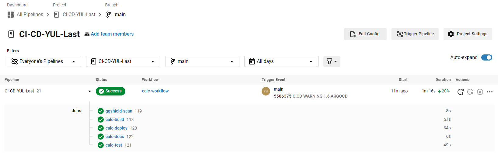
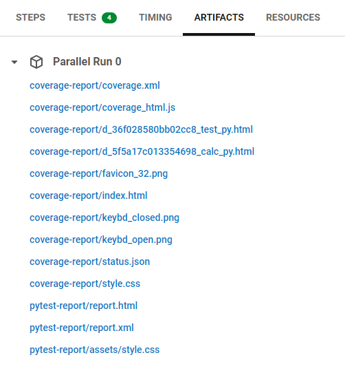

# Yul_CI-CD

## Description

Repositorio de una aplicación simple hecha **Flask (Python)**. Se trata de una formulario HTML cuya funcionalidad esta hecha con **Python**. Dispone de las siguientes operaciones: (sumar, restar, multiplicar y dividir). La aplicación corre sobre en un clúster de **Kubernetes** mediante **ArgoCD**.
La parte de **CICD** se realiza con **CircleCI** usando un **pipeline ( .yml )**.
Se somete a test con **pytest** y para la cobertura se usa **pytest-cov**. Para el linting de la aplicación se usa **pylint**.
Finalmente se realiza un análisis estático del código mediante SonarCloud.

## Video CI/CD (Loom)

## Estructura del Repositorio

- **Dockerfile**: Instrucciones para crear la imagen Docker.

- **app**: Contiene archivos de la aplicación.

  - **cacl.py**: Código de la app en **Python**
  - **templates/form.html**: Código HTML para visualizar la app.

- **test**: Contiene el archivo para realizar los test en el Pipeline

  - **test.py**

- **argocd**: Contiene archivos para la configuración de ArgoCD.

  - **argoapp.yml** contiene el código para la configuración de ArgoCD
  - **values.yaml** contiene ls configuración para Helm

- **k8s**: Contiene los manifiestos de Kubernetes para en el clúster

  - **deployment.yaml**
  - **ingress.yaml**
  - **service.yaml**

    - **/helm/calcpy**: Contiene archivos para Helm

      - **Chart.yaml**
      - **values.yaml**
      - **templates/**
        - **deployment.yaml**
        - **ingress.yaml**
        - **service.yaml**

- **.circleci**: Contiene el archivo para ejecutar el pipeline en CicleCI.

  - **config.yml**

- **sonar-project.properties**: Contiene la configuración para SonarCloud.

- **requirements.txt**: Contiene los requerimientos para la app

## Calc

### Capturas de pantalla

#### App

## CI/CD pipeline

### Capturas de pantalla

## Capturas de pantalla de DockerHub

> 

> ## Nota (DockerHub)
>
> Para poder usar DockerHub dentro del pipeline se ha de meter la contraseña del usuario
>
> 

> ## Nota (SonarCloud)
>
> Para poder usar SonarCloud se ha de generar un contexto dentro de CircleCI y después generar un token y guardarlo en las variables de entorno del proyecto.
> Se debe de usar una ORB para su funcionamiento. 

> 
> 
> 
>
> 
>
> 

> ## Note (GitGuardian)
>
> Para poder usar la herramienta de análisis de vulnerabilidades GitGuardian se ha de utilizar una ORB. 
> Ademas se debe añadir un token generado guardándolo en las variables de entorno de CircleCI.

> 

## ArgoCD

Se va a utilizar ArgoCD para el despliegue de la app.

## Resources app calculator kubernetes

## Fuentes

- **Kubernetes**: https://kubernetes.io/es/
- **Helm**: https://helm.sh/
- **Docker**: https://www.docker.com/
- **DockerHub**: https://hub.docker.com/
- **CircleCI**: https://circleci.com/
- **SonarCloud**: https://sonarcloud.io/
- **ArgoCD**: https://argoproj.github.io/argo-cd/
- **GitGuardian**: https://www.gitguardian.com/
- **Python**: https://www.python.org/
- **Flask**: https://flask.palletsprojects.com/en/2.0.x/
- **Pytest**: https://docs.pytest.org/en/6.2.x/
- **Coverage**: https://coverage.readthedocs.io/en/coverage-5.5/
- **Pylint**: https://www.pylint.org/
- **pdoc**: https://pdoc3.github.io/pdoc/
- **ChatGPT**: https://chat.openai.com/